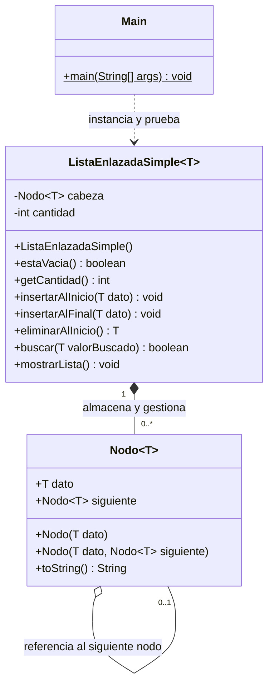
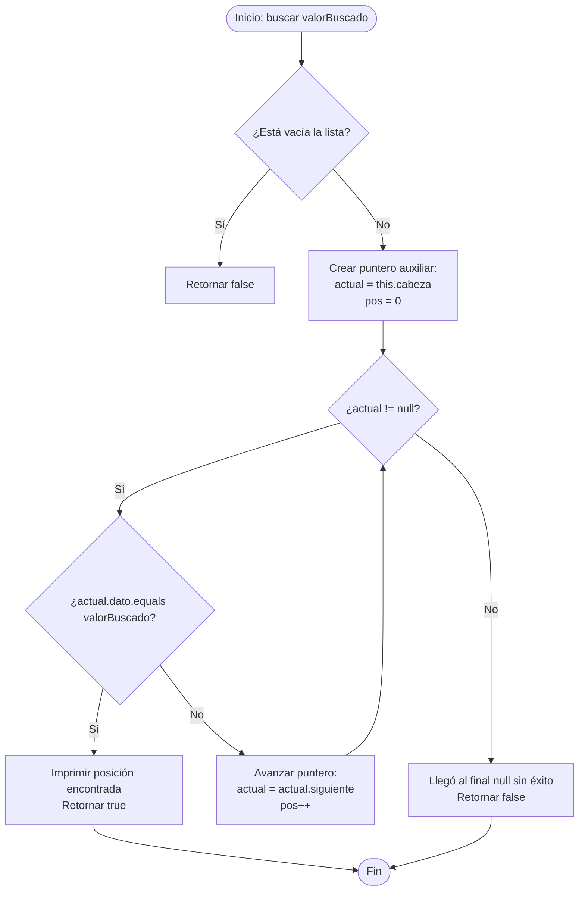

# Guía del Taller Práctico para el Estudiante: Listas Enlazadas en Java

```text
========================================================================================
ESCUELA SUPERIOR POLITÉCNICA AGROPECUARIA DE MANABÍ MANUEL FÉLIX LÓPEZ (ESPAM MFL)
CARRERA DE COMPUTACIÓN / SOFTWARE • MODALIDAD EN LÍNEA
Asignatura: Estructuras de Datos y Algoritmos (CDS-0202)
Docente:    Luiggi Alexander Jalca Saltos
Semestre:   Segundo Semestre "A" • Periodo Académico 2026-2027
Semana 1:   Sesión 02 (2 Horas Prácticas)
========================================================================================
```

---

## 🎯 1. ¡Bienvenido al Taller Práctico!

Estimado/a estudiante, en esta práctica de laboratorio desarrollarás y consolidarás la implementación de una **Lista Enlazada Simple genérica en Java (`ListaEnlazadaSimple<T>`)** utilizando **Visual Studio Code**.

El objetivo es conectar la teoría explicada por el docente en la Sesión 1 con la práctica real de código:
- Comprender cómo los objetos de tipo `Nodo<T>` se crean dinámicamente en la memoria **Heap** con el operador `new`.
- Manipular variables de referencia en el **Stack** sin perder la locomotora de la lista (`cabeza`).
- Observar el funcionamiento del **Garbage Collector** al desconectar nodos.
- Desarrollar de manera autónoma el algoritmo de **Búsqueda Secuencial** como actividad formativa acreditada en el SGA.

---

## 📂 2. Estructura de tu Proyecto

Abre esta carpeta en Visual Studio Code. Encontrarás la siguiente distribución:

```text
codigoestudiante/
│
├── README.md                      <- Esta guía de trabajo y consignas
│
└── src/                           <- Paquete de código fuente Java
    ├── Nodo.java                  <- Clase elemental del nodo (dato + puntero siguiente)
    ├── ListaEnlazadaSimple.java   <- TDA con métodos base y el reto a implementar
    └── Main.java                  <- Archivo de pruebas para verificar tu código
```

---

## 🏗️ 3. Diagrama de Clases UML del Proyecto

El siguiente diagrama muestra la relación entre las clases con las que trabajarás:



---

## 🧠 4. Modelo de Memoria: ¿Cómo se conectan los nodos en la RAM?

En una lista enlazada, los nodos **no están pegados** de forma contigua en memoria como en los arreglos; están dispersos en el **Heap** y se comunican a través de direcciones de memoria (referencias):

```text
  STACK (Variables Locales)                HEAP (Memoria Dinámica Dispersa)
 ┌──────────────────────────┐             ┌─────────────────────────────────────────────────────────┐
 │ lista (Ref: 0x500)       │────────────>│ Objeto ListaEnlazadaSimple (en 0x500)                   │
 └──────────────────────────┘             │  ├─ cabeza: 0x100                                       │
                                          │  └─ cantidad: 3                                         │
                                          └─────────────────────────────────────────────────────────┘
                                                        │
                                                        ▼
                                          ┌────────────────────────────┐
                                          │ Nodo 1 (en 0x100)          │
                                          │  ├─ dato: 10               │
                                          │  └─ siguiente: 0x204       │
                                          └────────────────────────────┘
                                                        │
                                                        ▼
                                          ┌────────────────────────────┐
                                          │ Nodo 2 (en 0x204)          │
                                          │  ├─ dato: 20               │
                                          │  └─ siguiente: 0x3A0       │
                                          └────────────────────────────┘
                                                        │
                                                        ▼
                                          ┌────────────────────────────┐
                                          │ Nodo 3 (en 0x3A0)          │
                                          │  ├─ dato: 30               │
                                          │  └─ siguiente: null (FIN)  │
                                          └────────────────────────────┘
```

> **🦉 Regla Crítica de Memoria:**  
> La variable `cabeza` es el único punto de entrada a la lista. Si ejecutas por error `this.cabeza = this.cabeza.siguiente` para recorrer la lista, perderás para siempre los nodos anteriores y el Garbage Collector los destruirá. **¡Usa siempre un puntero auxiliar local `actual`!**

---

## 🔍 5. Explicación de las Clases Entregadas

### 5.1. `Nodo.java`
Es el contenedor individual (el "vagón del tren"). Contiene el campo `T dato` (información almacenada) y `Nodo<T> siguiente` (el gancho que apunta al siguiente vagón).

### 5.2. `ListaEnlazadaSimple.java`
Contiene las operaciones explicadas durante la clase magistral:
- `estaVacia()`: Verifica si `cabeza == null` en tiempo constante **$O(1)$**.
- `insertarAlInicio(T dato)`: Enlaza un nuevo nodo antes de la cabeza actual en tiempo **$O(1)$**.
- `insertarAlFinal(T dato)`: Recorre hasta el último vagón para conectarlo en tiempo **$O(N)$**.
- `mostrarLista()`: Imprime el estado visual en formato `[10] -> [20] -> null`.
- `eliminarAlInicio()`: Desconecta el primer nodo en **$O(1)$** permitiendo que el Garbage Collector libere su memoria.

---

## 📋 6. Tu Tarea: Taller Práctico Autónomo (1.0 Hora TA)

```text
========================================================================================
FICHA OFICIAL DE TRABAJO AUTÓNOMO (SGA - SEMANA 1)
Asignatura:       Estructuras de Datos y Algoritmos (CDS-0202)
Actividad:        Taller Práctico Individual sin Acompañamiento Docente
Acreditación:     1.0 Hora de Trabajo Autónomo (Componente TA 30%)
Entrega:          Subir el archivo ListaEnlazadaSimple.java con captura a Moodle
========================================================================================
```

### 6.1. ¿Qué debes implementar?
Abre el archivo `src/ListaEnlazadaSimple.java` y busca la sección marcada con `TODO`. Debes implementar el método:

```java
public boolean buscar(T valorBuscado)
```

El método debe retornar `true` si el elemento se encuentra dentro de la lista, o `false` si no existe, sin alterar ni perder ningún elemento de la estructura.

### 6.2. Diagrama de Flujo del Algoritmo que Debes Programar

Guíate por este diagrama de flujo para diseñar tu solución:



### 6.3. Pasos Lógicos Recomendados:
1. **Comprobar lista vacía:** Si `estaVacia()`, retorna `false`.
2. **Crear puntero auxiliar:** Declara `Nodo<T> actual = this.cabeza;` e inicializa un contador `int pos = 0;`.
3. **Bucle de avance:** Usa un ciclo `while (actual != null)`.
4. **Comparación segura:** Usa `actual.dato.equals(valorBuscado)` (recuerda que en objetos genéricos se usa `.equals()`, no `==`).
5. **Retorno si coincide:** Si coincide, imprime en consola y retorna `true`.
6. **Avanzar el puntero:** Si no coincide, haz `actual = actual.siguiente;` y aumenta `pos`.
7. **Retorno final:** Si termina el bucle sin encontrarlo, retorna `false`.

---

## 🚀 7. Cómo Probar tu Código en Visual Studio Code

### Paso 1: Abrir la Carpeta
1. Abre **Visual Studio Code**.
2. Menú **Archivo (File) > Abrir Carpeta... (Open Folder...)**.
3. Selecciona la carpeta:
   ```text
   codigoestudiante
   ```

### Paso 2: Editar y Descomentar las Pruebas
1. Abre `src/ListaEnlazadaSimple.java` y escribe tu código en el método `buscar(T valorBuscado)`.
2. Abre `src/Main.java`, ubica el **PASO 4** y descomenta las líneas de prueba comentadas.

### Paso 3: Compilar y Ejecutar por Terminal
Abre la terminal integrada en VS Code con `` Ctrl + ` `` y ejecuta:

```powershell
# 1. Compilar los archivos Java
javac src/*.java

# 2. Ejecutar la clase Main
java -cp src Main
```

### Salida que deberías obtener al finalizar con éxito:
```text
>>> PASO 4: Búsqueda Lineal de Elementos (Taller Autónomo)
  1. Buscando el número 30 (que sí existe):
     Resultado obtenido: true | Esperado: true

  2. Buscando el número 99 (que no existe):
     Resultado obtenido: false | Esperado: false
```

¡Muchos éxitos en el desarrollo de tu taller!
